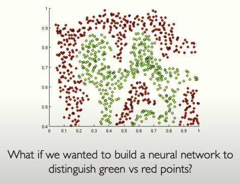
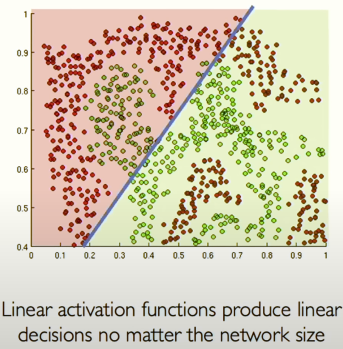
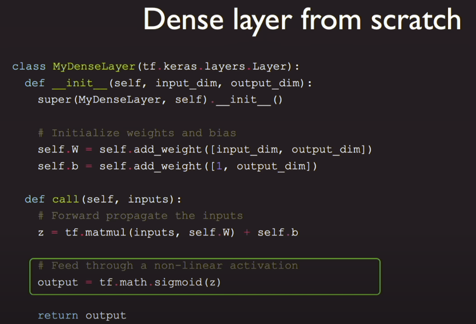
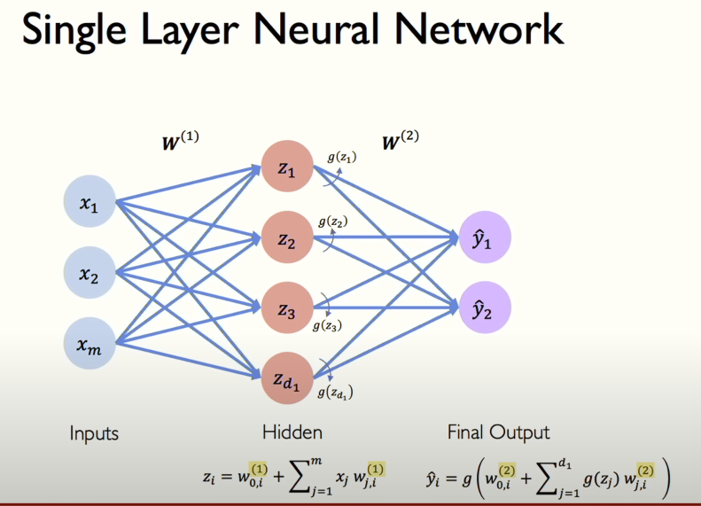
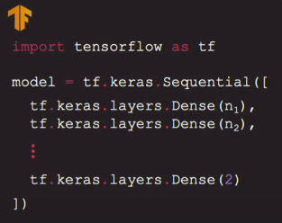
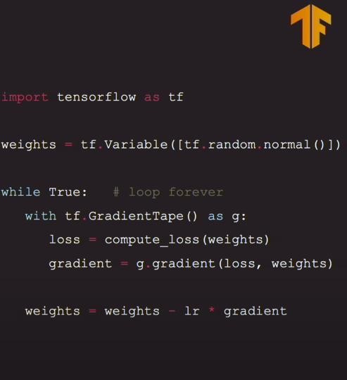
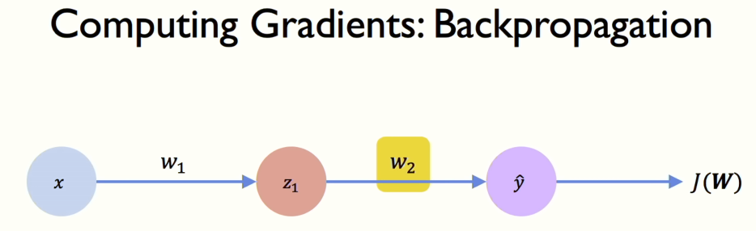
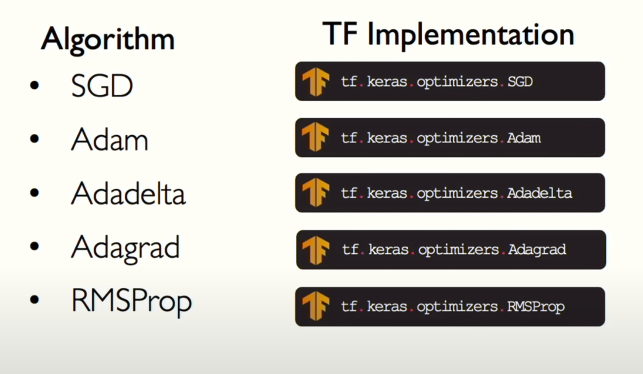

## Why Deep Learning?

Hand engineered features are time consuming, brittle and not scalable in practice. Can we learn the underlying features directly from data

## Why Now?

    1. We have big data available
    2. GPU's (massive parallelization)
    3. Software: TensorFlow makes it easy to create ML models that can run in any environment.

## Neuron (perceptron)

1. A Neuron taking 3 inputs (and each input will be multiplied by a particular weight) xi \* wi
2. Pass the above number through a non-linear activation function
3. Before passing the number through non-linear function, we add a bias(a bias value allows you to shift the activation function to the left or right, which may be critical for successful learning.)

### Non-linear activation function

1. Sigmoid: he sigmoid function is a fundamental component in neural networks, particularly in binary classification problems. It serves as an activation function, mapping the input values to a probability range between 0 and 1. This bounded range makes it `useful for calculations involving probabilities`.
2. ReLU: it takes the input x and returns 0 if x is negative, and x itself if x is positive.

   f(x) = max(0, x)

## Why do we need the activation functions?

The purpose of activation functions is to introduce non-linearities into the network

## Create a Dense Layer

## Single Layer Neural Network

where you have set of inputs going through one level of hidden layers to produce the output

## Deep Neural Network

input, going through n numbers of hidden layers to produce the output which has two neurons

## Loss Functions

We have a basic neural network, we need to train it, we will do that by calculating the loss between the actual output vs the predicted output and the closer the values are, the loss would be less and model is more accurate

- Empirical loss: Measures the total loss over our entire dataset
- Binary Cross Entropy Loss: can be used with models that output a probability between 0 and 1

- Softmax Cross Entropy with Logits: Softmax Cross Entropy with Logits is a widely used loss function in neural networks for multi-class classification problems. It combines two essential components:

  1. Softmax: a normalization function that converts unnormalized log probabilities (logits) into a probability distribution over multiple classes.
  2. Cross Entropy: a measure of the difference between the predicted probabilities and the true labels.
  3. Logits are the unnormalized output values from a neural network’s final layer, typically a linear or affine transformation of the input data. They represent the “scores” or “energies” assigned to each class.

Instead of a binary output, we want to predict a real number, for ex, grade for students in a class

- Mean Squared Error Loss: can be used with regression models that output continuous real numbers

## Training & Gradient Descent

we have the loss function which will tell us the loss and our objective is to find the network weights that achieve the lowest loss which means we are trying to find the weights for the neural network based on all the data that we have seen.

Weight is nothing but just a vector which we are trying to find and our loss is a function of the network weights

    Step 1: If we have only two input, we can plot our loss function in the 3d graph
    Step 2: Pick a random point on the graph, from that place lets computer the gradient (local estima of where is slop is increasings)
    Step 3: Take small step in opposite direction of gradient by updating weights
    Step 4: Repeat step 2 & 3 until we found a local minimum

As you see in the image, we are multiplying something with the gradient i.e., learning rate

> Gradient tells us which way is up in that landscape and it also tells how our loss is changing as a function of all our weightsm how does it do that?

## Backpropogation

Consider a single input going to a single neuron and that neuron output is going as an input to another neuron

How does a small change in one weight affect the loss (whether its going up or down)? Refer image in PDF for the formula

## Setting the learning rate

    - Small learning rate converges sllowly and gets stuck in false local minima
    - Large Learning rate overshoot, become unstable and diverge
    - Stable learning rates converge smoothly and avoid local minima

To fix it

1. Try lot of different learning rate and find
2. Design a adaptive learning rate that adapts to the landscape

## Batched Gradient Descent

    - Computing Gradient can be very computationally intensive to compute instead lets define another gradient algo: SGD (Stochastic Gradient Descent)
    - SGD: the gradient is computed for a single training example (or a mini-batch of examples of size 32) instead of the entire dataset, making it more efficient and scalable.
        - mini batches lead to fast training, can parallelize computation + achieve significant speed increases on GPU's

## Regularization: dropout and early stopping

    - Underfitting: Underfitting occurs when a neural network is too simple or has too few parameters to capture the underlying patterns in the training data. As a result, the model fails to learn the relationships between inputs and outputs, leading to poor performance on both training and test datasets.
    - Overfitting: Overfitting occurs when a neural network is too complex and learns the noise and random fluctuations in the training data instead of the underlying patterns. As a result, the model performs well on the training data but poorly on new, unseen data.

> Regularization in neural networks is a set of techniques used to prevent overfitting and improve the model's ability to generalize to new, unseen data.

    1. Dropout: Dropout is a technique specific to neural networks where randomly selected neurons are "dropped out" (i.e., ignored) during training, forcing the network to learn more robust features by setting the activations to 0
    2: EarlyStopping: This technique involves halting the training process when the validation error stops improving, preventing the model from overfitting to the training data.
